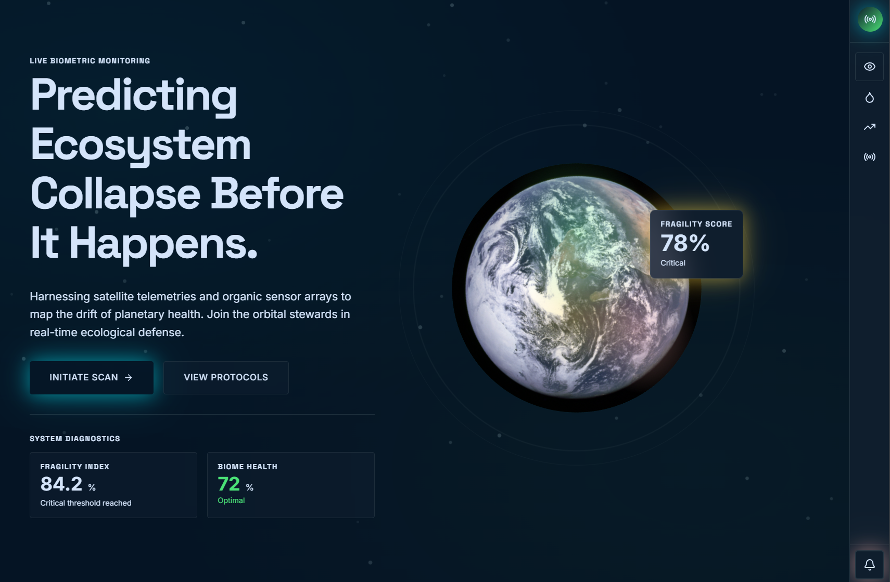
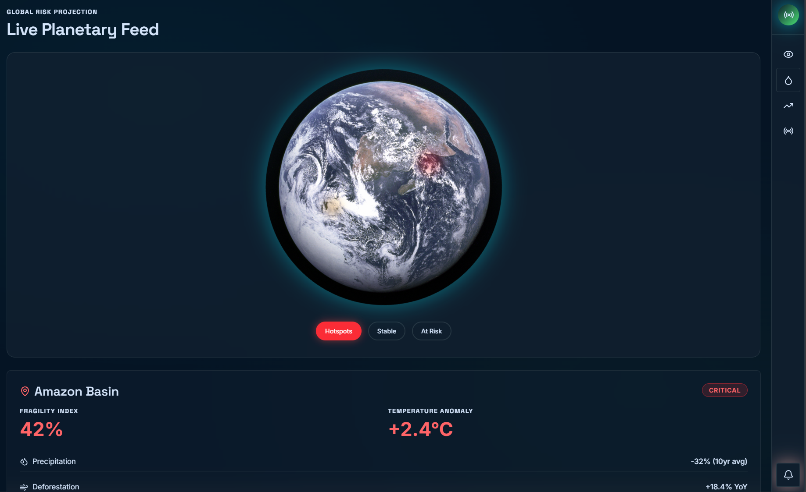
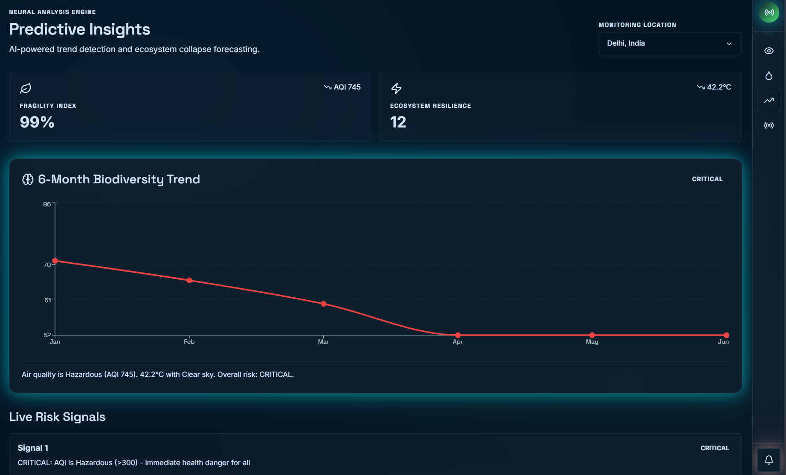
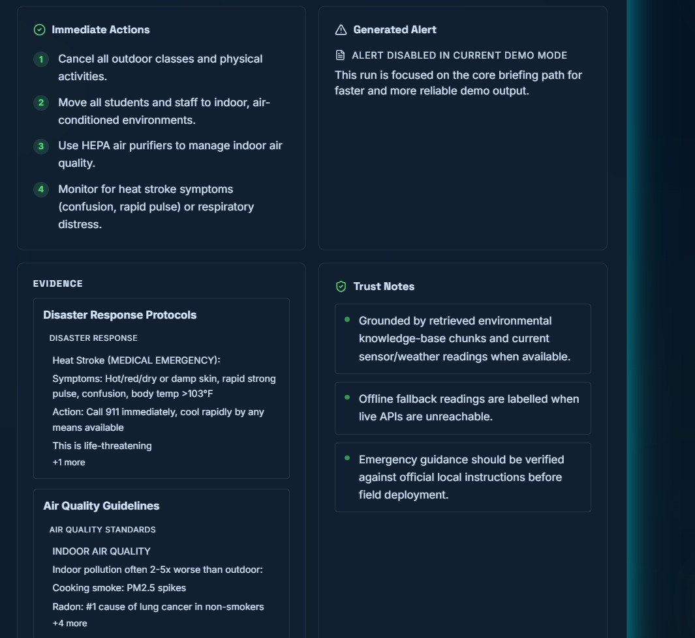
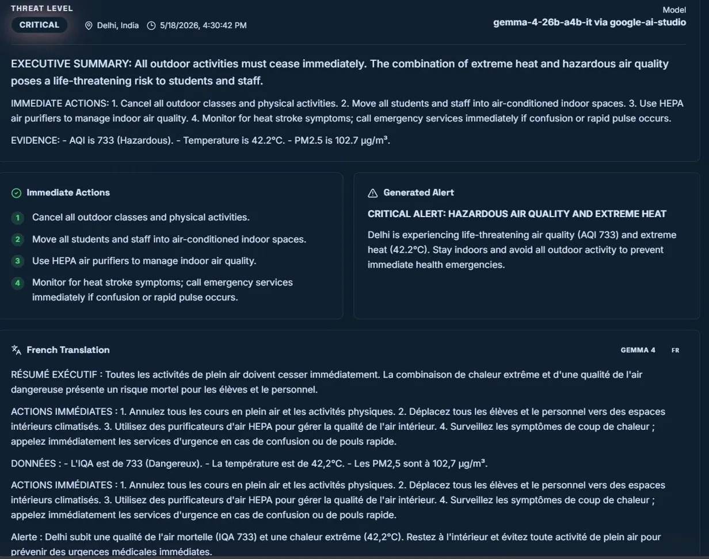

# 🌍 EcoSentinels

> **AI-powered environmental intelligence platform** — real-time ecosystem risk monitoring, biodiversity forecasting, and community alert generation powered by Gemma 4 + RAG.

Built for the **Kaggle Gemma 4 Good Hackathon**.

[](https://eco-sentinels-frontend.vercel.app)
[](https://fastapi.tiangolo.com)
[](https://react.dev)
[](https://ai.google.dev)

> **Note:** The AI backend runs locally via Cloudflare Tunnel. 
> The live demo is active during judging. If the backend is unreachable, 
> the frontend falls back to offline scenario data automatically.
---
## 📸 Screenshots


*Dashboard — Neural Modeling Score with 3D Earth globe*



*Risk Map — Live planetary feed with hotspot filtering and region details*



*Insights — 6-month biodiversity trend powered by live AQI and weather data*



*Eco-Intel — Gemma 4 field briefing with threat level, immediate actions* 


*Multi-language translation — French alert output via Gemma 4*

---

## 💡 What Problem Does It Solve?

EcoSentinels bridges the gap between raw environmental sensor data and **actionable field intelligence**. It answers:

- 🔴 **What is happening?** — Live AQI, temperature, precipitation, wind anomalies
- 📍 **Where is the risk?** — Geospatial hotspot mapping across critical global regions
- ⚠️ **How severe is it?** — AI-classified severity: `low → moderate → high → critical`
- 🚨 **What should communities do right now?** — Gemma 4-generated field briefings and emergency alerts in multiple languages

---

## 🖥️ Product Pages
> All pages are accessible via the **EcoSentinels** side navigation panel with hover-expand and mobile support.

### 📊 Dashboard — Neural Modeling Score
- Interactive **3D Earth globe** with live ecosystem fragility overlays
- **Biodiversity Drift Timeline** (2017–2026) showing accelerating species loss
- **Early Warning Cluster** — real-time alerts for microbiome collapse, hydraulic stress, and reforestation activity
- System stats: 12,840 active monitoring stations, 2.1M species indexed, 99.8% AI confidence
- **Scan Upload** and **Protocols** modals for field responders

### 🗺️ Risk Map — Live Planetary Feed
- Interactive 3D globe with **Hotspot / At-Risk / Stable** filter modes
- Detailed region cards with fragility index, temperature anomaly, precipitation trends, deforestation rate, and soil moisture
- 6 monitored regions: Amazon Basin, Arctic Circle, Great Barrier Reef, Congo Rainforest, Scandinavian Forest Belt, New Zealand Alpine Zone

### 📈 Insights — Predictive Intelligence
- **6-Month Biodiversity Trend** chart — dynamically colored by live severity
- **Fragility Index** and **Ecosystem Resilience** scores derived from real AQI + temperature data
- **Live Risk Signals** — AI-flagged environmental alerts with severity tagging
- **Live Monitoring Snapshot** — real-time weather and AQI per location
- 4 monitoring locations: Amazon Basin, Delhi, Great Barrier Reef, Arctic Circle

### 🧭 Eco-Intel — AI Field Briefings
- **Community Briefing Panel** — the hero AI workflow powered by Gemma 4 + RAG
- **Active Hotspots** — priority AI-detected crisis zones (Amazon, Great Barrier Reef, Himalayan Glacier)
- Generates: threat level, executive summary, immediate actions, supporting evidence, trust notes, model/provider details
- **Multi-language alert translation** (ES, FR, PT, HI, SW, AR, ZH, BN) — translates alert title, summary, and immediate actions via `/alerts/translate`

---

## 🧠 Tech Stack

### Frontend
| Tech | Purpose |
|------|---------|
| React + TypeScript | UI framework |
| Vite | Build tool |
| Tailwind CSS | Styling |
| Framer Motion | Animations |
| Recharts | Data visualizations |
| Lucide Icons | Icon system |
| **Vercel** | Deployment |

### Backend
| Tech | Purpose |
|------|---------|
| FastAPI (Python) | REST API server |
| ChromaDB | Vector store (78 chunks, 7 knowledge docs) |
| LangChain | RAG orchestration |
| sentence-transformers | ONNX local embeddings |
| Gemma 4 (26B-A4B) | LLM via Google AI |
| Open-Meteo | Free real-time air quality + weather API |
| httpx | Async HTTP client |
| Pydantic v2 | Schema validation |

---

## 🏗️ Architecture

```
Browser (Vercel)
      │
      ▼
React Frontend
      │  VITE_API_BASE (direct)
      ▼
FastAPI RAG Backend (port 6000)
      │
      ├── /data/*     ── Open-Meteo Air Quality + Weather APIs
      ├── /rag/*      ── ChromaDB Vector Store + Gemma 4 LLM
      └── /alerts/*   ── Alert Generation + Translation Agent
```

### Multi-Agent System
Three specialized agents work in concert:
- **DataAgent** — fetches live air quality (PM2.5, PM10, NO2, O3, AQI) and weather (temp, wind, precipitation, UV, 3-day forecast) from Open-Meteo
- **AnalystAgent** — RAG retrieval over 7 curated environmental knowledge bases, synthesized by Gemma 4
- **AlertAgent** — structured community emergency alert generation with multi-language translation

> If live APIs are unreachable, the system falls back to representative offline scenario data with clear trust notes — so demos never break.

---

## 🌐 API Endpoints

| Method | Route | Description |
|--------|-------|-------------|
| `GET` | `/health` | Service health + RAG readiness |
| `GET` | `/data/air-quality?lat=&lon=` | Live AQI, PM2.5, PM10, NO2, O3 |
| `GET` | `/data/weather?lat=&lon=` | Current weather + 3-day forecast |
| `POST` | `/data/analyze` | Full environmental analysis + risk flags |
| `POST` | `/rag/query` | RAG knowledge query (mode: `rag` or `agent`) |
| `POST` | `/rag/briefing` | Full community field briefing generation |
| `GET` | `/rag/search?q=` | Semantic search over knowledge base |
| `POST` | `/alerts/generate` | AI emergency alert generation |
| `POST` | `/alerts/translate?alert_text=&language=` | Translate alert title, summary, and actions to target language |
| `GET` | `/alerts/severity-guide` | Severity thresholds reference |

---

## ⚙️ Local Setup

### Prerequisites
- Python 3.11+
- Node.js 18+
- pnpm

### 1. Clone the repo
```bash
git clone https://github.com/ayush-kr-repo/EcoSentinels.git
cd EcoSentinels
```

### 2. Backend setup
```bash
cd services/eco-rag

# Create virtual environment
py -3.11 -m venv venv

# Activate (Windows PowerShell)
.\venv\Scripts\Activate.ps1
# Activate (Mac/Linux)
source venv/bin/activate

# Install dependencies
pip install --upgrade pip setuptools wheel
pip install -r requirements.txt
```

Create `services/eco-rag/.env`:
```env
GOOGLE_API_KEY=your_google_api_key_here
GEMMA_MODEL=gemma-4-26b-a4b-it
RAG_PORT=6000
LOG_LEVEL=info
LLM_TIMEOUT_SECONDS=90
```

### 3. Frontend setup
```bash
cd frontend
pnpm install
```

Create `frontend/.env`:
```env
VITE_API_BASE=http://localhost:6000
```

### 4. Run locally (2 terminals)

**Terminal 1 — FastAPI backend:**
```bash
cd services/eco-rag
.\venv\Scripts\Activate.ps1
python main.py
# → http://localhost:6000
# → API docs: http://localhost:6000/docs
```

**Terminal 2 — Frontend:**
```bash
cd frontend
pnpm dev
# → http://localhost:5173
```

### Health check
```bash
curl http://localhost:6000/health
# {"status": "healthy", "rag_ready": true, ...}
```

> ⏱️ On first startup, ChromaDB downloads the ONNX embedding model (~79MB). RAG becomes ready in ~30 seconds. The `/health` endpoint reports `rag_ready: false` until then.

---

## 🌍 Monitored Locations

| Location | Coordinates | Key Risk |
|----------|-------------|----------|
| Amazon Basin | -3.47°N, -62.22°E | Deforestation, AQI, heat |
| Delhi, India | 28.61°N, 77.21°E | Hazardous AQI, extreme heat |
| Great Barrier Reef | -18.29°N, 147.70°E | Ocean temp, bleaching |
| Arctic Circle | 69.65°N, 18.96°E | Glacial melt, permafrost |

---

## 📁 Project Structure

```
EcoSentinels/
├── frontend/                        # React + Vite frontend (deployed on Vercel)
│   ├── src/
│   │   ├── app/
│   │   │   └── components/
│   │   │       ├── figma/           # Figma-generated assets
│   │   │       ├── ui/              # Reusable UI primitives
│   │   │       ├── DashboardPage.tsx
│   │   │       ├── RiskMapPage.tsx
│   │   │       ├── InsightsPage.tsx
│   │   │       ├── EcoIntelligencePage.tsx
│   │   │       ├── CommunityBriefingPanel.tsx
│   │   │       ├── BiodiversityDashboard.tsx
│   │   │       ├── AIPredictiveInsights.tsx
│   │   │       ├── EnvironmentalAlerts.tsx
│   │   │       ├── Realistic3DEarth.tsx
│   │   │       ├── FlattenedWorldMap.tsx
│   │   │       ├── ScanUploadModal.tsx
│   │   │       ├── ProtocolsModal.tsx
│   │   │       └── Navigation.tsx
│   │   ├── lib/
│   │   │   ├── insightsApi.ts       # Insights page API client
│   │   │   └── ecosentinelsApi.ts   # Community briefing API client
│   │   ├── App.tsx
│   │   └── main.tsx
│   ├── index.html
│   ├── vite.config.ts
│   └── package.json
├── services/eco-rag/                # FastAPI RAG + agent backend
│   ├── main.py                      # FastAPI app entry point + lifespan
│   ├── config.py                    # Settings (port, model, paths)
│   ├── routers/
│   │   ├── rag_router.py            # POST /rag/query, /rag/briefing, GET /rag/search
│   │   ├── data_router.py           # GET /data/air-quality, /data/weather, POST /data/analyze
│   │   └── alert_router.py          # POST /alerts/generate, /alerts/translate
│   ├── agents/
│   │   ├── environmental_agent.py   # Multi-agent: DataAgent + AnalystAgent
│   │   └── alert_agent.py           # AlertAgent + translation
│   ├── rag/
│   │   ├── pipeline.py              # Gemma 4 RAG chain
│   │   └── vectorstore.py           # ChromaDB + ONNX embeddings
│   ├── models/                      # Pydantic schemas
│   ├── data/
│   │   ├── knowledge_base/          # 7 curated environmental documents
│   │   └── chroma_db/               # Persisted vector store (78 chunks)
│   └── .env
├── artifacts/api-server/            # Legacy Express gateway (not used in production)
├── docs/                            # Architecture and submission docs
├── scripts/
├── .env.example
└── README.md
```

---

## 🌐 Multi-Language Alert Translation

When a community briefing is generated, responders can translate the actionable content into 8 languages directly from the UI.

### How it works
1. User runs a field briefing for a scenario (e.g. Delhi — Hazardous AQI)
2. Briefing is generated by Gemma 4 via the `/rag/briefing` endpoint
3. User selects a target language from the dropdown (EN, ES, FR, PT, HI, SW, AR, ZH, BN)
4. Frontend extracts the **alert title**, **alert summary**, and **immediate actions** from the briefing
5. This focused payload is sent to `POST /alerts/translate?alert_text=&language=`
6. Gemma 4 translates and returns the result, rendered in a dedicated translation card

### Why only alert title + summary + actions?
The executive summary returned by the backend already embeds immediate actions and evidence inline as a single text block. Sending the full executive summary to the translate endpoint caused:
- **Duplication** — actions appeared twice in the translation output
- **Truncation** — the payload exceeded what the model reliably translated in one pass

Sending only the structured actionable content keeps translations clean, complete, and fast.

### Supported languages
| Code | Language |
|------|----------|
| ES | Spanish |
| FR | French |
| PT | Portuguese |
| HI | Hindi |
| SW | Swahili |
| AR | Arabic |
| ZH | Chinese |
| BN | Bengali |

---

## 📐 Mathematical & Scientific Architecture

EcoSentinels translates raw, multi-variate environmental data streams into actionable jurisdictional directives. While some deep predictive indices operate as target UI benchmarks in the current demo phase, the underlying framework is built on proven ecological modeling equations and vector-search pipelines.

---

### 1. The Ecological Fragility Index ($F$)
To evaluate how close a specific monitored ecosystem is to an irreversible threshold, the system maps computed ecological drift against a sigmoidal threshold function:

$$F = \frac{1}{1 + e^{-k(V - V_0)}} \times 100$$

* **$V$**: The calculated Raw Drift Variance of the current ecosystem vector.
* **$V_0$**: The baseline tipping inflection point defined by historical metadata for that specific biome.
* **$k$**: A scaling factor governing the transition curve's sharpness as the ecosystem approaches a tipping threshold.

> **Academic Backing:** Sigmoidal curves are widely used in structural resilience frameworks to map systemic vulnerability indexes. For deeper insights into multi-dimensional state indicators, see the [International Organization for Migration (IOM) Fragility Index Framework](https://southsudan.iom.int/sites/g/files/tmzbdl1046/files/documents/2025-02/021725_-fragility-summary-and-index.pdf) and analytical approaches to collapse modeling published in [Frontiers: Data-Driven State Fragility Index Measurements](https://www.frontiersin.org/journals/physics/articles/10.3389/fphy.2022.830774/full).

---

### 2. Multi-Variate Ecological Distance ($D_M$)
To ingest live environmental data (such as parameters from the Open-Meteo API) without being misled by natural correlations (e.g., how high ambient heat covaries with low humidity), the backend evaluates systemic drift using a covariance-adjusted distance metric:

$$D_M(\vec{x}) = \sqrt{(\vec{x} - \vec{\mu})^T \Sigma^{-1} (\vec{x} - \vec{\mu})}$$

* **$\vec{x}$**: High-dimensional vector of live readings ($T_a$, AQI, PM2.5, Humidity).
* **$\vec{\mu}$**: Vector of historical, multi-decade seasonal baseline means for those specific coordinates.
* **$\Sigma^{-1}$**: The inverse covariance matrix of the environmental indicators.

> **Academic Backing:** The Mahalanobis Distance is preferred over standard Euclidean distances in ecological niche modeling because it natively weights interdependent variables. For technical implementation examples in planetary tracking, review [Wageningen University Research (WUR): Uncertainty in Species Distribution Modeling](https://edepot.wur.nl/287221) and [NIH PubMed Central: Mahalanobis Distances and Ecological Niche Modelling](https://pmc.ncbi.nlm.nih.gov/articles/PMC6450376/).

---

### 3. Critical Slowing Down & Trend Autocorrelation ($\text{AR}(1)$)
When an ecosystem's structural resilience breaks down (as seen in the fragmentation of the Great Indian Bustard's native grasslands), its recovery rate from immediate environmental stress decays. The **6-Month Biodiversity Trend Engine** maps this using a first-order autoregressive model:

$$x_{t+1} = \alpha x_t + \epsilon_t$$

* **$x_t$**: The deviation or anomaly of an ecological indicator at time $t$.
* **$\alpha$**: The lag-1 autocorrelation coefficient.
* **$\epsilon_t$**: A white-noise error term representing standard environmental background noise.

> **Academic Backing:** As a complex natural system nears a critical transition or bifurcation point, its internal recovery rate approaches zero. This phenomenon—**Critical Slowing Down (CSD)**—causes the lag-1 autocorrelation factor ($\alpha$) to approach $1$, serving as a mathematical early-warning flag. See [The MITRE Corporation: Early Warning Signals of Tipping Points](https://www.mitre.org/sites/default/files/pdf/12_4711.pdf) and verification profiles on [ResearchGate: Critical Slowing Down in Biological Systems](https://www.researchgate.net/figure/Critical-slowing-down-leads-to-increasing-variation-and-autocorrelation-time-in_fig2_225086390).

---

### 4. RAG-Driven Directive Verification (Cosine Similarity)
To ensure the immediate field actions generated by our LLM orchestration engine (`gemma-4-26b-a4b-it`) are legally grounded and locally compliant, our Retrieval-Augmented Generation (RAG) pipeline computes the angular distance between high-dimensional prompt queries ($\vec{q}$) and regulatory reference vectors ($\vec{d}_i$):

$$\text{Similarity}(\vec{q}, \vec{d}_i) = \frac{\vec{q} \cdot \vec{d}_i}{\|\vec{q}\| \|\vec{d}_i\|} = \frac{\sum_{j=1}^{n} q_j d_{ij}}{\sqrt{\sum_{j=1}^{n} q_j^2} \sqrt{\sum_{j=1}^{n} d_{ij}^2}}$$

This ensures that instead of unverified text strings, high authorities are presented with directives tied explicitly via vector similarity math to local environmental laws, Air Quality Guidelines, and regional emergency protocols.

## 🔮 Future Improvements

- Permanent cloud backend deployment (Render / Railway)
- Richer globe hotspot interaction with drill-down reports
- Stronger source provenance and citation display
- Faster multi-step briefing generation
- Mobile-optimized layouts
- Full-page translation (all sections) in target language
- User-defined monitoring locations 

---

## 👥 Team Members
| Members | Contribution |
|------|----------|
|Ayush Kumar|Team Lead, Backend, Deployment|
|Debopriya Bose|UI/UX, FrontEnd implementation|
|Durlabh Biswas|Ideation, Writeup, Video|
|Parthiv Dutta|Script, Video Editing|
|Ansh Jairaj|Script, Writeup|

## 📄 License

[](LICENSE)

---
